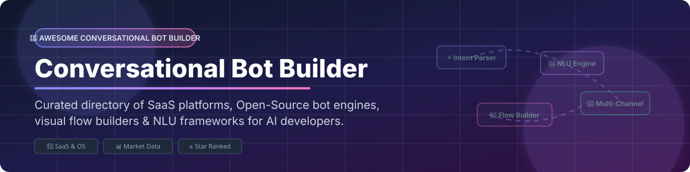

# 🤖 Awesome Conversational Bot Builder

  

  
  
  
  
  

> **⚡ Curated Directory of SaaS Bot Builders & Open-Source Conversational AI Frameworks**  
> *Focused on Visual Flow Builders, NLU Engines, Dialogue Management, LLM Chaining & Multi-Channel Bot Deployment.*

**📅 Last updated: October 2026**

---

This repository tracks notable **SaaS platforms** and **open-source projects** for **Conversational Bot Builders**. These tools empower developers, enterprise architects, and CX teams to design, build, test, and deploy intelligent AI chatbots and voice assistants across web, mobile, messaging platforms, and contact centers.

---

## 📖 Table of Contents

- [☁️ SaaS / Hosted Conversational AI Platforms](#-saas--hosted-conversational-ai-platforms)
- [🔓 Open-Source GitHub Projects](#-open-source-github-projects)
- [🤝 How to Contribute](#-how-to-contribute)
- [💖 Support & Sponsorship](#-support--sponsorship)
- [📊 Star History](#-star-history)
- [⚠️ Disclaimer](#%EF%B8%8F-disclaimer)

---

## ☁️ SaaS / Hosted Conversational AI Platforms

> **📊 Market Size & Sector Structure**: The global conversational AI market size is estimated at **~$14.79B in 2025** and is projected to expand toward **~$82.46B by 2034** at a CAGR of **~21%**. The market structure is **moderately fragmented**: cloud hyper-scalers (Amazon, Google, Microsoft) co-exist alongside specialized enterprise suites (Cognigy, Kore.ai, Ada, Yellow.ai). No single vendor holds a winner-take-all monopoly, and enterprise architectures typically deploy multi-vendor stacks.

Platforms are sorted by enterprise size / revenue & valuation in descending order.

| Platform | Description | Pricing (Starting Tier) | Free Tier / Trial Limits | Company Size & Scale (Descending) |
|---|---|---|---|---|
| **[Amazon Lex](https://aws.amazon.com/lex/)** ☁️ | AWS conversational AI powered by Alexa deep learning. Features intent recognition, slot filling, and multi-turn dialogue. | **$0.00075 / text request** ($0.004 / audio request) | **AWS Free Tier**: 10,000 text requests + 5,000 speech requests/month for 12 months | **~$638B revenue** (Amazon FY2025) |
| **[Google Dialogflow](https://cloud.google.com/dialogflow)** 🔍 | Google Cloud's NLU platform with intent & entity parsing. Includes **Dialogflow CX** for advanced flowchart design. | **Dialogflow ES**: $0.002 / text query; **Dialogflow CX**: $0.007 / text query | **Dialogflow ES**: 1,000 text queries/day free; **CX**: $600 GCP trial credits for 90 days | **~$350B revenue** (Alphabet FY2025) |
| **[Microsoft Power Virtual Agents](https://powervirtualagents.microsoft.com/)** 🟦 | Low-code conversational bot builder within Microsoft Power Platform. Deep integration with Teams & Azure. | **$200 / month** for 25,000 messages (tenant packs) | **30-Day Free Trial** with full platform capabilities | **~$281B revenue** (Microsoft FY2025) |
| **[Yellow.ai](https://yellow.ai/)** 🟡 | Enterprise AI agents for customer support & CX with NLU, voice bots, and multi-channel automation. | **$99 / month** (Growth tier starting price) | **Freemium Plan**: 5,000 monthly bot conversations, FAQ engine, 2 channels | **~$1B valuation** (~$102M raised) |
| **[Kore.ai](https://kore.ai/)** 🤖 | Enterprise virtual assistant platform featuring hybrid NLU, LLM orchestration, and contact center automation. | **$100 minimum reload** (Pay-as-you-go payg model) | **5,000 Free Sessions** per account across up to 5 bots | **~$1B valuation** (~$150M+ raised) |
| **[Ada](https://www.ada.cx/)** 💬 | Enterprise AI customer service platform automating over 4 billion customer interactions globally. | **$33,000 / year** (AWS Marketplace entry point for 60,000 conversations) | **14-Day Enterprise Trial** (Available upon sales demo approval) | **~$200M+ raised** (Valued at ~$1.2B) |
| **[Cognigy](https://www.cognigy.com/)** 🏢 | Enterprise AI agent platform providing omnichannel contact center automation, voicebots, and NLU flow builders. | **~$2,500 / month** (Starting enterprise package) | **14-Day Free Platform Trial** (No credit card required) | **~$100M+ raised** (Enterprise growth stage) |

---

## 🔓 Open-Source GitHub Projects

Sorted by GitHub Stars_Count in descending order.

| Repo | Description | GitHub_Stars |
|---|---|---|
| **[Rasa](https://github.com/RasaHQ/rasa)** 🐍 | Enterprise open-source conversational AI framework. Features NLU pipelines, dialogue management, custom Python actions, and multi-channel connectors (Slack, Telegram, Twilio). Apache-2.0. |  |
| **[Botpress](https://github.com/botpress/botpress)** ⚡ | Open-source framework for building AI digital assistants with visual drag-and-drop flow builder, managed NLU, and human-in-the-loop handoff. AGPLv3. |  |
| **[Botkit](https://github.com/howdyai/botkit)** 🛠️ | Developer toolkit for building chat bots and custom integrations with event handlers (`hears()`, `ask()`, `reply()`), middleware, and platform adapters. Part of Microsoft Bot Framework. MIT. |  |
| **[CopilotKit](https://github.com/CopilotKit/CopilotKit)** 💡 | Open-source React framework to build in-app AI chatbots, copilot assistants, and generative text UI components. MIT. |  |
| **[BotMan](https://github.com/botman/botman)** 🐘 | The most popular open-source PHP chatbot framework. Framework-agnostic (Laravel, Symfony) with multi-channel adapters (Slack, Telegram, Messenger, Alexa). MIT. |  |
| **[Tock](https://github.com/theopenconversationkit/tock)** 📦 | Open-source conversational AI toolkit with Tock Studio UI, conversational DSL for Kotlin/Node.js/Python, and built-in connectors (Messenger, WhatsApp, Alexa, Docker). Apache-2.0. |  |
| **[Kairon](https://github.com/digiteinfotech/kairon)** 🔮 | Conversational AI platform to build proactive digital assistants using visual LLM chaining, enterprise role-based security, and intent analytics. Apache-2.0. |  |
| **[KnowBase AI](https://github.com/SamurAIGPT/ai-knowledge-base)** 🧠 | Open-source AI knowledge base & custom chatbot builder built on Next.js with RAG, document parsing, website scraping, and embeddable chat widgets. Apache-2.0. |  |
| **[EDDI](https://github.com/labsai/EDDI)** ⚙️ | Prompt & conversation management middleware for AI APIs (OpenAI, Anthropic Claude, Google Gemini, Ollama). Cloud-native RESTful server in Java/Quarkus. Apache-2.0. |  |
| **[Tiledesk Chatbot Engine](https://github.com/Tiledesk/tiledesk-chatbot)** 🎨 | Open-source multichannel chatbot framework and alternative to Voiceflow & Landbot. Node.js backend integrating with Tiledesk Design Studio. MIT. |  |
| **[rasa-admin](https://github.com/nesterapp/rasa-admin)** 🎛️ | Open-source administrative UI dashboard for managing Rasa deployments, intent training data, and dialogue logs. MIT. |  |

---

## 🤝 How to Contribute

Contributions are warmly welcomed! Please follow these guidelines when submitting a pull request:

1. Fork the repository.
2. Edit `README.md` to add your suggested bot builder platform or open-source tool.
3. Ensure entries adhere to the table structure, including verified pricing/Stars_Counts and explicit free tier or trial limits.
4. Submit a Pull Request with a clear description of the project.

---

## 💖 Support & Sponsorship

If you find this repository helpful for your projects or research, consider supporting the maintainer!

- ⭐ **Star** this repository to increase visibility.
- 🔀 **Fork** it to keep a copy and contribute back.
- 📢 **Share** it on Twitter/X, LinkedIn, or developer forums.
- ☕ **Buy Me a Coffee / Sponsor**: Support ongoing maintenance via [GitHub Sponsors](https://github.com/sponsors/ishandutta2007).

---

## 📊 Star History

---

## ⚠️ Disclaimer

- This list is **community-curated** for educational and research purposes.
- Conversational AI tools process sensitive user text and voice data; ensure full compliance with GDPR, CCPA, and enterprise privacy standards.
- Pricing figures and free tier specifications were verified at the time of writing but may change over time.
